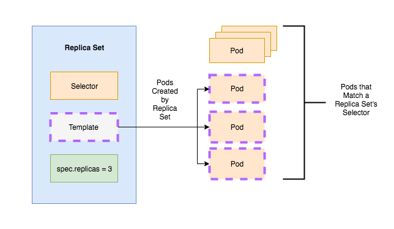
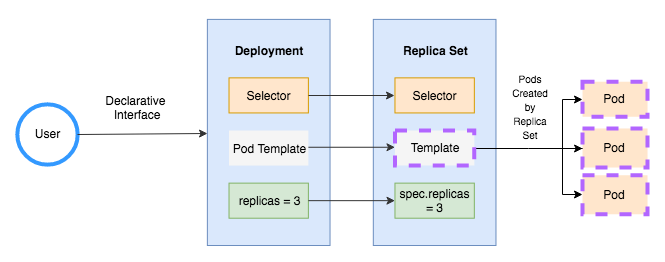

# Kubernetes controllers

We are discussing 3 main types of controllers [here](https://www.mirantis.com/blog/kubernetes-replication-controller-replica-set-and-deployments-understanding-replication-options/).

URLs to refer:

1. https://www.mirantis.com/blog/kubernetes-replication-controller-replica-set-and-deployments-understanding-replication-options/
2. https://www.edureka.co/community/43891/difference-between-replica-set-and-replication-controller

1. ReplicationController

2. ReplicationSet

### Differences b/w `ReplicationController` and `ReplicationSet`

|Replica Set|Replication Controller|
|-----------|----------------------|
|Replica Set supports the new set-based selector. This gives more flexibility. for eg: environment in (production, qa) This selects all resources with key equal to environment and value equal to production or qa |Replication Controller only supports equality-based selector. for eg: environment = production . This selects all resources with key equal to environment and value equal to production|
|rollout command is used for updating the replica set. Even though replica set can be used independently, it is best used along with deployments  which makes them declarative. | rolling-update command is used for updating the replication controller. This replaces the specified replication controller with a new replication controller by updating one pod at a time to use the new PodTemplate.|

3. Deployment

### Deployment Strategies

[Here](https://blog.container-solutions.com/kubernetes-deployment-strategies) are some possible kubernetes strategies.

This [url](https://github.com/Duffney/Kubernetes-Update-Apps-The-Hard-Way) has code with strategies.

[roll-back](https://learnk8s.io/kubernetes-rollbacks)
