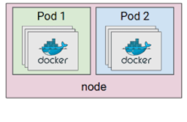

We would cover following topics of Pod

## What's Pod:

A Pod is the basic/atomic/smallest execution unit of a Kubernetes application that you can deploy on to kubernetes cluster.

Kubernetes pod consist of one or more containers.  `Docker` is the widely used container [runtime](https://kubernetes.io/docs/setup/production-environment/container-runtimes/).

A Pod represents a unit of deployment: a single instance of an application in Kubernetes, which might consist of either a single container or a small number of containers that are tightly coupled and that share resources.

### Pod with single container:

Following images shows pod with single container.

