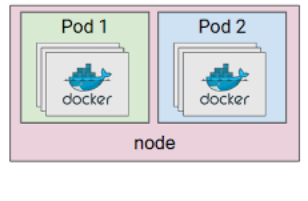
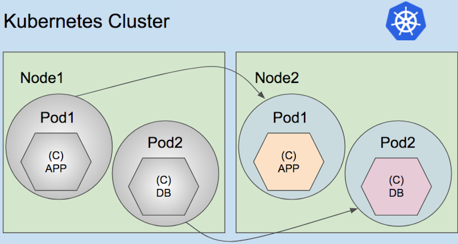

We would cover following topics of Pod


      What's Pods
      Command to created Pod
      Pod yaml manifest
      Pod LifeCycle


## What's Pod:

A Pod is the basic/atomic/smallest execution unit of a Kubernetes application that you can deploy on to kubernetes cluster.

Kubernetes pod consist of one or more containers.  `Docker` is the widely used container [runtime](https://kubernetes.io/docs/setup/production-environment/container-runtimes/).

A Pod represents a unit of deployment: a single instance of an application in Kubernetes, which might consist of either a single container or a small number of containers that are tightly coupled and that share resources.

Each Pod is meant to run a single instance of a given application. If you want to scale your application horizontally (e.g., run multiple instances), you should use multiple Pods, one for each instance. In Kubernetes, this is generally referred to as replication. Replicated Pods are usually created and managed as a group by an abstraction called a [Controller](./controllers.md).


### Resource sharing and communication

Pods enable data sharing and communication among their constituents.

The applications in a Pod all use the same network namespace (same IP and port space), and can thus “find” each other and communicate using `localhost`. Because of this, applications in a Pod must coordinate their usage of ports.

https://coreos.com/kubernetes/docs/latest/pods.html

### Pod with single container:

The `one-container-per-Pod` model is the most common Kubernetes use case; in this case, you can think of a Pod as a wrapper around a single container, and Kubernetes manages the Pods rather than the containers directly.

Following images shows pod with single container.



### Pod with multiple containers:

A pod might enclose an application composed of multiple co-located containers that are tightly coupled and need to share resources.

Following images shows pod with multiple containers.



The primary purpose of a multi-container Pod is to support co-located, co-managed helper processes for a primary application. There are some general patterns for using helper processes in Pods. We have 3 types of [multi-pod-patterns](https://kubernetes.io/blog/2015/06/the-distributed-system-toolkit-patterns/) as show below.
```
                 i. Sidecar
                 ii. Ambassador
                 iii. Adaptor

```


https://www.mirantis.com/blog/multi-container-pods-and-container-communication-in-kubernetes/

#### Sidecar:

`help` the main container. Some examples include log or data change watchers, monitoring adapters, and so on.
A log watcher, for example, can be built once by a different team and reused across different applications. Another example of a sidecar container is a file or data loader that generates data for the main container.


#### Adaptor:

#### Ambassador:
